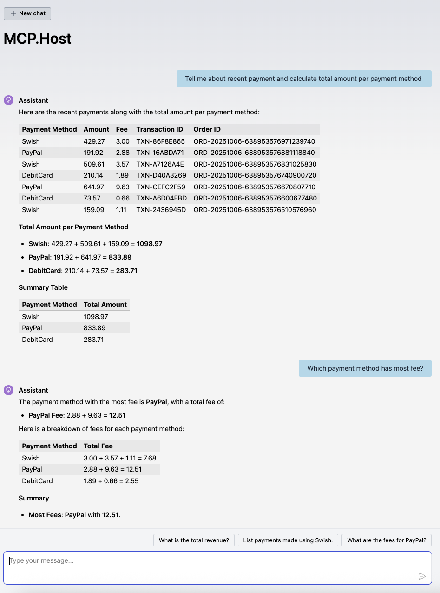
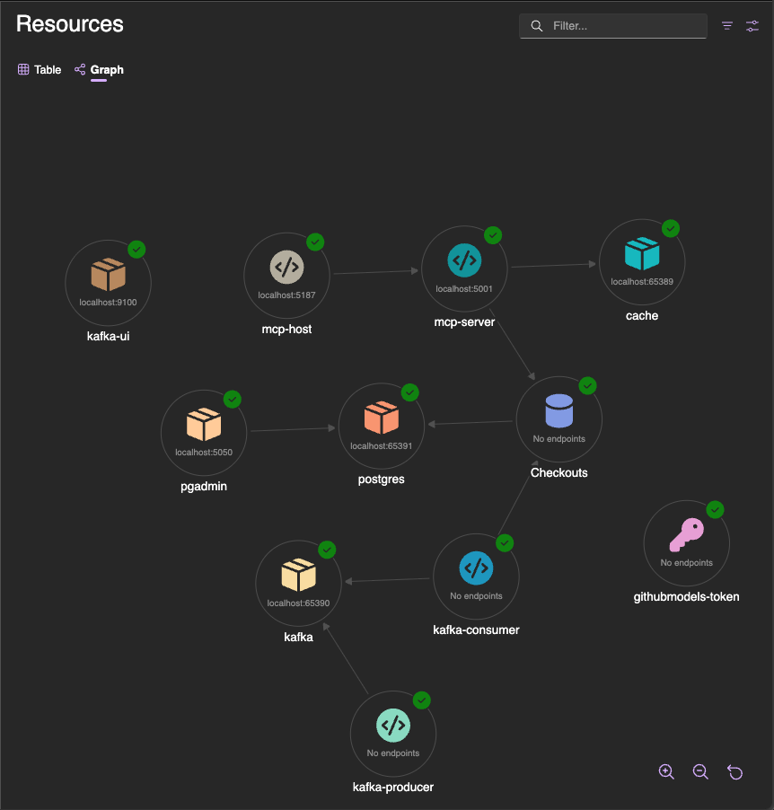
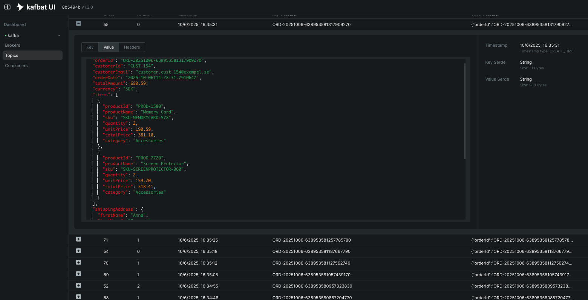
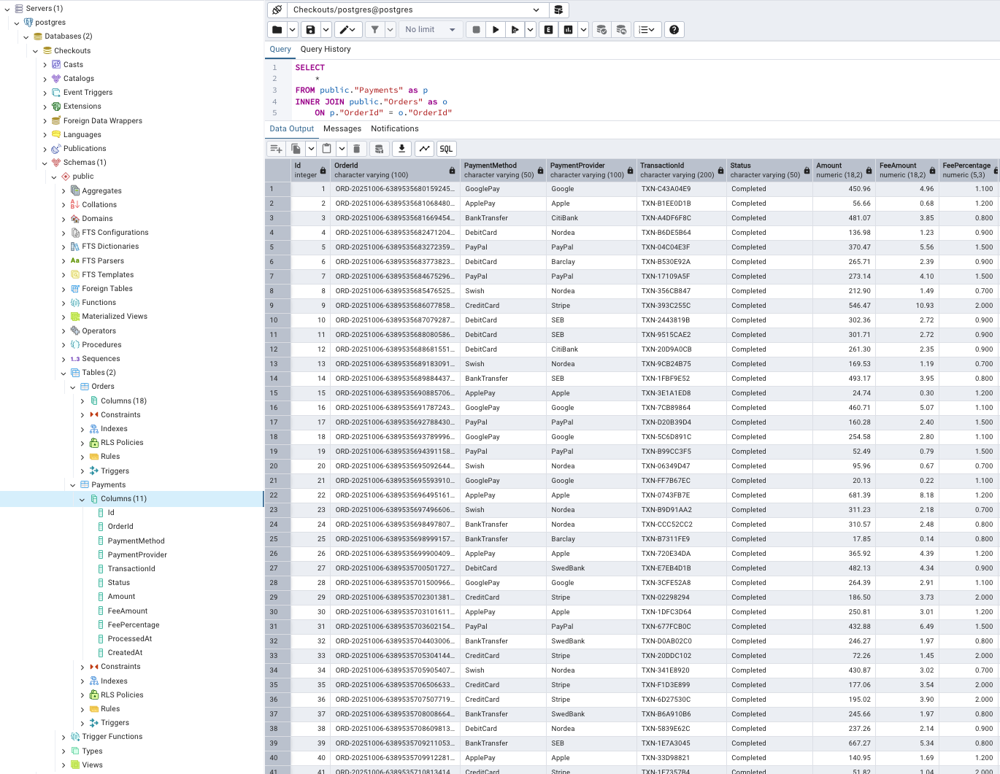

# Business AI Integration Demo

This project demonstrates how to integrate AI capabilities into a typical business application with `.NET Platform` It showcases a common scenario where business events flow through the system and get processed, stored, and then made available for AI-powered interactions.

<p>

</p>

## What This Project Shows

This is a hands-on learning project that combines:
- **Event-driven architecture** with Kafka for processing business data
- **AI integration** using Model Context Protocol (MCP) to interact with stored data
- **Modern development practices** with .NET Aspire for orchestration
- **.NET Platform** features for building AI applicatıon

The demo simulates a simple e-commerce flow where orders are generated, processed, and stored - then made accessible through an AI chat interface that can answer questions about the business data.

## Projects

### 🎛️ **Demo.Host** (.NET Aspire Orchestrator)
The main orchestrator that manages all services and provides a unified development experience with observability and monitoring.

**To run the complete demo:**
```bash
dotnet run --project Demo.Host
```
*Opens Aspire dashboard with unified logging, metrics, and service management*

### 🚀 **Kafka.Producer**
Generates mock e-commerce order events to simulate real business activity.

**Features:**
- Creates realistic order data every 5-10 seconds
- Publishes events to the `order-events` Kafka topic


### 📥 **Kafka.Consumer**
Processes incoming order events and stores them in the database for later use.

**Features:**
- Consumes messages from Kafka topics
- Stores order and payment data in PostgreSQL
- Handles business logic like fee calculations

### 🧠 **AI.Agent.Custom**
A custom AI agent implementation(just some dummy agent) using Microsoft's Agent Framework, exposed as an MCP tool for learning and experimentation.

**Features:**
- Implements `CustomAgent` using Microsoft Agent Framework
- Maintains conversation context through persistent thread storage
- Thread state is preserved across application restarts in `{BaseDirectory}/thread/agent_thread.json`

**Key Components:**
- `CustomAgent`: Custom agent implementation with thread persistence
- `CustomAgentThread`: Thread management with JSON serialization/deserialization
- Thread reuse: Automatically loads existing threads on startup to maintain conversation history

### 🤖 **MCP.Server**
Provides AI tools that can access business data stored in the database and hosts the custom AI agent.

**Features:**
- Exposes business data through MCP protocol
- Hosts the `CustomAgent` as an MCP tool
- Allows AI to retrieve recent payments
- Caches frequently accessed data for performance

#### Listing Tools for MCP Server ####
```bash
curl -X POST https://localhost:5001/ \
  -H 'Content-Type: application/json' \
  -H 'Accept: application/json, text/event-stream' \
  -H 'MCP-Protocol-Version: 2025-06-18' \
  -d '{
    "jsonrpc":"2.0",
    "id":2,
    "method":"tools/list",
    "params":{}
  }'
```

#### Result ####
```bash
event: message
data: {
    "result": {
        "tools": [
            {
                "name": "get_random_number",
                "description": "Generates a random number between the specified minimum and maximum values.",
                "inputSchema": {
                    "type": "object",
                    "properties": {
                        "min": {
                            "description": "Minimum value (inclusive)",
                            "type": "integer",
                            "default": 0
                        },
                        "max": {
                            "description": "Maximum value (exclusive)",
                            "type": "integer",
                            "default": 100
                        }
                    }
                }
            },
            {
                "name": "accountant_does_financial_calculations",
                "description": "Accountant Agent that can perform financial calculations for net amounts for orders payments",
                "inputSchema": {
                    "type": "object",
                    "properties": {
                        "query": {
                            "description": "Input query to invoke the agent.",
                            "type": "string"
                        }
                    },
                    "required": [
                        "query"
                    ]
                }
            },
            {
                "name": "get_recent_payments",
                "description": "Returns recent payment transactions from the payment system",
                "inputSchema": {
                    "type": "object",
                    "properties": {
                        "count": {
                            "description": "Number of payments",
                            "type": "integer",
                            "default": 7
                        }
                    }
                }
            }
        ]
    },
    "id": 2,
    "jsonrpc": "2.0"
}

```

### 💬 **MCP.Host**
A web interface where users can chat with AI about their business data.

**Features:**
- Interactive chat interface
- AI can answer questions about business related data such payments
- Connects to external AI models through GitHub Models

## Architecture

```
                            ┌─────────────────┐
                            │   🎛️Demo.Host   │
                            │  (.NET Aspire)  │
                            │ - Orchestration │
                            │ - Observability │
                            │ - Configuration │
                            └─────────────────┘
                                     │
                                     │ manages development environment
                                     ▼
 ─────────────────────────────────────────────────────────────────────────────────────────────────────────
              ┌─────────────────┐                    ┌───────────────────┐     PostgreSQL
              │     Producer    │                    │      Consumer     │   ┌─────────────┐
              │                 │                    │                   │   │   Orders    │
              │ - Order Events  │                    │ - Event Processing│──►│   Table     │
              │ - Mock Data     │                    │ - Business Logic  │   │             │
              │ - Publishing    │                    │ - Data Storage    │   ├─────────────┤
              └─────────────────┘                    └───────────────────┘   │  Payments   │
                     │                                         ▲  │          │   Table     │
                     │                                         │  │          ├─────────────┤
                     │                                         │  │          │   Fees      │
                     │                                         │  │          │   Table     │
                     │           ┌─────────────────┐           │  │          └─────────────┘
                     │           │     Kafka       │           │  │                │
                     │           │                 │           │  │                │
                     └─────────► │ - Topics        │ ──────────┘                   │
                                 │   - order-events│                               │
                                 │                 │                               │
                                 └─────────────────┘                  provides data│
                                                                                   │ 
                                                                                   │
┌──────────────────┐                                                               │ 
│     AI.Agent     │                                                               │     
│  (CustomAgent)   │                                                               │
│                  │                                                               │ 
│ - Agent Framework│                                                               │
│ - Thread State   │───────┐                                                       │ 
│ - Persistence    │       │Agent used as a tool                                   │
└──────────────────┘       │                                                       │ 
                           │                                                       │
                           │                                                       │
                           |                                                       │
              ┌─────────────────┐                                                  │
              │    MCP.Server   │                                                  │
              │                 │◄─────────────────────────────────────────────────┘
              │ - Business APIs │                 
              │ - Data Caching  │                 
              │ - MCP Tools     │                  
              │ - Agent Hosting │                 
              └─────────────────┘───┐                 
                       │            │                                 
                       │            │                                 
                       │            │     ┌─────────────────┐         
                       │            └────►│   Cache(Valkey) │
                       │                  │                 │
                       │                  │                 │
                       │                  └─────────────────┘   
                       │
                       │
                       │ MCP protocol
                       ▼
              ┌─────────────────┐        External AI      
              │   MCP.Host(web) │   ┌─────────────────┐
              │                 │───│  GitHub Models  │
              │ - Web Interface │   │                 │
              │ - AI Integration│   │ - LLMs          │
              │ - Chat Features │   │                 │
              └─────────────────┘   └─────────────────┘
```





## How It Works

1. **Data Generation**: The Producer generates realistic order events with some payment info also. And publishes the order event to a `Kafka` topic. 



2. **Event Processing**: The Consumer processes events from given Kafka topic and stores business data. Also some mock fancy business operation is done. And all related data is inserted into `PostgreSQL` database.



3. **AI Access**: An MCP Server exposes business data through standardized APIs within .NET Platform. It is a remote MCP endpoint. .NET Platform has a template to create a minimal MCP Server: `dotnet new mcpserver`


4. **User Interaction**: Users chat with AI through the web interface to get insights about their business data. Based on one of .NET templates: `dotnet new aichatweb` For this demonstration, `gpt-4o-mini` is used via `GitHub Models` 

- In this view within a given simple prompt, host application can understand which MCP tool to be invoked and `get_recent_payments` tool is called remotly.
- MCP server's `get_recent_payments` returns just some data from a database.
- Host application uses the result from MCP server to generate more responsive and effective result for given prompt. 


This demonstrates a practical approach to building AI-powered business applications using modern development tools and patterns with .NET.

## References

- https://learn.microsoft.com/en-us/dotnet/ai/
- https://learn.microsoft.com/en-us/agent-framework/overview/agent-framework-overview